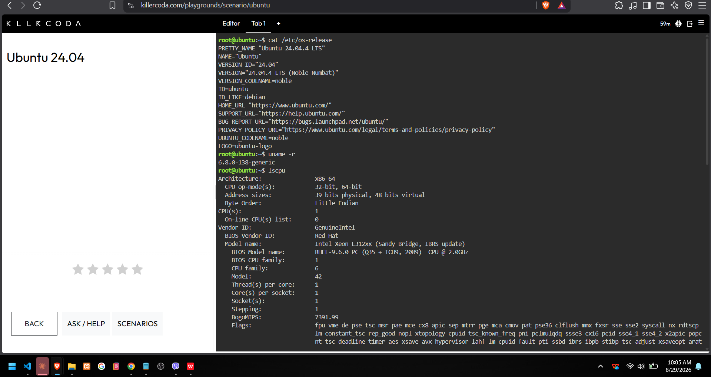

# Checkpoint 7 - Linux Investigation

**KillerCoda Cloud Migration:** If this Linux server were migrated to the cloud, it could be hosted on virtual machine services across any major provider. Specifically, I would use **Amazon EC2** on AWS, **Azure Virtual Machines** on Microsoft Azure, or **Compute Engine** on Google Cloud Platform (GCP).
