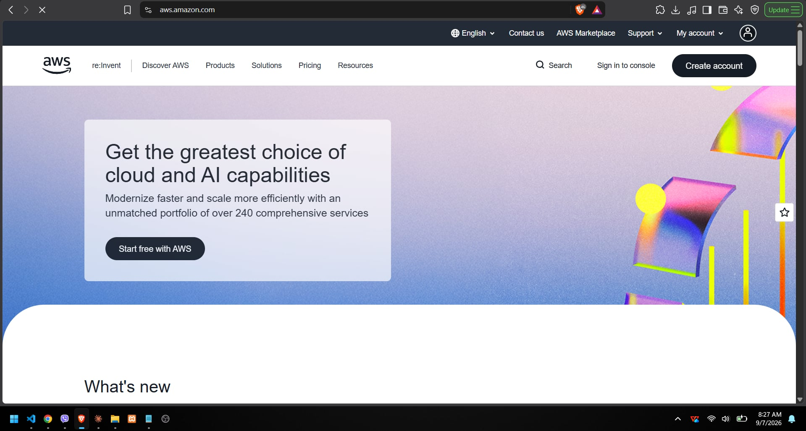

**Brief Overview:** Amazon Web Services (AWS) is the pioneer and current market leader in public cloud computing, offering the most comprehensive and broadly adopted cloud platform globally.
**Global Infrastructure:** AWS spans 105 Availability Zones within 33 geographic regions.
**Cloud Management Console:** Web-based interface known as the AWS Management Console.

**Four Core Services:** Elastic Compute Cloud (EC2), Simple Storage Service (S3), Virtual Private Cloud (VPC), Identity and Access Management (IAM).
**Three Advantages:** Largest community and ecosystem, highly mature service offerings, unparalleled scale.
**Typical Enterprise Use Cases:** High-traffic global web applications, massive data lakes, and full-scale enterprise data center migrations.
