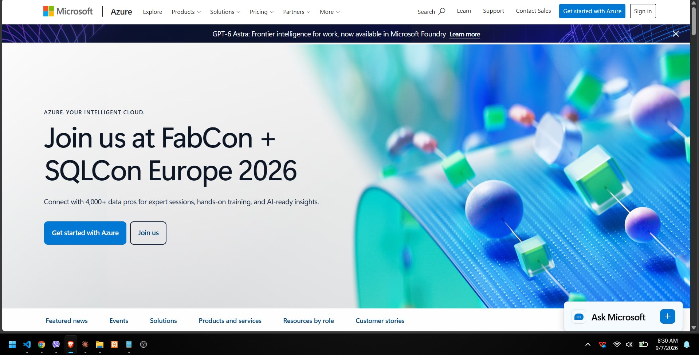

**Brief Overview:** Microsoft Azure is a massive, highly integrated cloud platform designed heavily around enterprise environments.
**Global Infrastructure:** Available in over 60 regions globally.
**Cloud Management Console:** Web-based interface known as the Azure Portal.

**Four Core Services:** Azure Virtual Machines, Azure Blob Storage, Azure Virtual Network, Microsoft Entra ID.
**Three Advantages:** Seamless integration with Microsoft products, robust hybrid cloud capabilities, strong security.
**Typical Enterprise Use Cases:** Migrating existing Windows Server environments, hybrid architectures, and enterprise application hosting.
