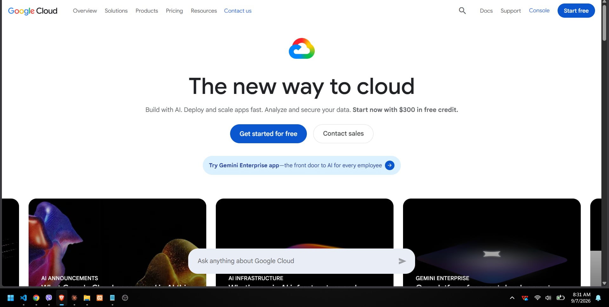

**Brief Overview:** Google Cloud Platform (GCP) leverages the same high-performance infrastructure that powers Google's end-user products.
**Global Infrastructure:** 40 regions and 121 zones globally.
**Cloud Management Console:** Web-based interface known as the Google Cloud Console.

**Four Core Services:** Compute Engine, Cloud Storage, Google Kubernetes Engine (GKE), Cloud SQL.
**Three Advantages:** Industry-leading data analytics, top-tier container orchestration, competitive pricing.
**Typical Enterprise Use Cases:** Deep machine learning, containerized microservices, and massive-scale data analytics.
